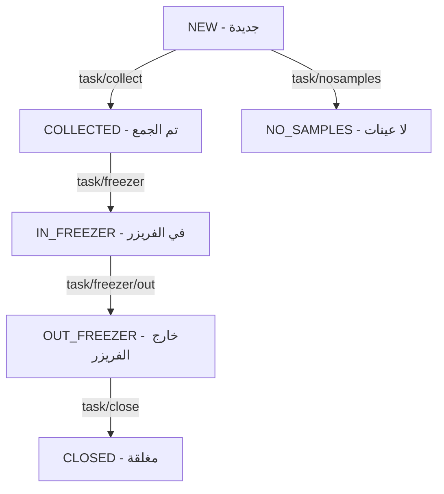

# تفاصيل شاشات Flutter - الجزء الثاني (Part 2: Freezer + Delivery + Swap + Money + Services)
# الفريزر + التوصيل + التبادل + التحويلات + الخدمات

---

## 10. Freezer Placement Screens — شاشات وضع العينات في الفريزر

### 10.1 FreezerOutBagsScreen — مسح الأكياس ← `FreezerOutBagsScanFragment`

**التدفق والوصول (Navigation Flow):**
- **كيف تصل إليها:** من `TaskListScreen` عند اختيار مهمة حالتها `COLLECTED` (أي بعد تجميع العينات).
- **إلى أين تأخذك:** إلى `FreezerContainerScanScreen` بعد مسح جميع الأكياس بنجاح.

**التصميم**: ماسح باركود + قائمة الأكياس الممسوحة + زر Continue
**الوصول**: من TaskList عند اختيار مهمة COLLECTED

```
اللوجيك:
├── عند فتح الشاشة:
│   └── POST task/bags/get مع {task_id} لجلب الأكياس
├── عند مسح باركود كيس:
│   ├── تحقق أنه موجود في قائمة الأكياس
│   ├── أضفه لقائمة الممسوح (scannedBagBarCodes Set)
│   └── حدّث العرض
├── عند الضغط على Continue:
│   ├── إذا تم مسح جميع الأكياس:
│   │   └── انتقل لـ FreezerScanContainerBarcodeFragment
│   └── إذا لم تُمسح كلها: Toast تحذير
```

### 10.2 FreezerContainerScanScreen — مسح باركود الحاوية ← `FreezerScanContainerBarcodeFragment`

**التدفق والوصول (Navigation Flow):**
- **كيف تصل إليها:** إما من `FreezerOutBagsScreen` (بعد مسح الأكياس لمهمة جديدة)، أو من `TaskListScreen` مباشرة إذا كانت حالة المهمة `IN_FREEZER`.
- **إلى أين تأخذك:** إلى `TaskDetailScreen` لعرض تفاصيل المهمة داخل الحاوية.

**التصميم**: ماسح باركود كبير + حقل نصي يدوي + زر Submit

```
اللوجيك:
├── امسح أو أدخل باركود الحاوية يدوياً
├── عند النجاح:
│   ├── احفظ scannedContainerId + scannedContainerType في UserInfo
│   └── انتقل لـ TaskDetailFragment
```

### 10.3 FreezerBagScanScreen — مسح باركود الكيس ← `FreezerScanBagBarcodeFragment`

**التدفق والوصول (Navigation Flow):**
- **كيف تصل إليها:** تُستدعى من داخل `TaskDetailScreen` عند الحاجة لمسح كيس جديد إضافي.
- **إلى أين تأخذك:** تعود بك إلى `TaskDetailScreen` مع بيانات الكيس الممسوح.

**التصميم**: ماسح باركود + حقل يدوي

```
اللوجيك:
├── امسح باركود الكيس
├── احفظ scannedBagBarCode في UserInfo
└── انتقل لـ TaskDetailFragment
```

### 10.4 TaskDetailScreen — تفاصيل مهمة الفريزر ← `TaskDetailFragment`

**التدفق والوصول (Navigation Flow):**
- **كيف تصل إليها:** من `FreezerContainerScanScreen` (أو بعد مسح كيس في `FreezerBagScanScreen`).
- **إلى أين تأخذك:** إلى `TaskStatusScreen` (شاشة النجاح) بعد الضغط على Close Freezers وإنهاء عملية الوضع/الإخراج.

**التصميم**: يتغير حسب النوع (COLLECTED أو IN_FREEZER)
- Dropdown حاوية (Spinner)
- قائمة عينات الكيس
- أزرار: Add Bag / Scan Freezer / Save Bag / Close Freezers

```
اللوجيك (حالة COLLECTED):
├── عند الفتح:
│   ├── POST task/containers/bag للحصول على الحاويات
│   ├── تحقق أن الحاوية الممسوحة هي الصحيحة (isCorrectContainer)
│   ├── إذا صحيحة: POST samples/bag/type لجلب العينات
│   └── إذا خاطئة: Toast "Scan correct container"
├── أزرار ديناميكية:
│   ├── إذا لا يوجد scannedContainerType → أخفِ Submit و Close
│   ├── إذا لا يوجد scannedBagBarCode → أخفِ قائمة الباركودات
│   └── إذا يوجد كلاهما → اعرض الكل
├── زر Save Bag:
│   ├── تحقق: containerId != 0
│   ├── حوار تأكيد
│   └── POST samples/container/add مع {task_id, container_id, bag_code}
├── زر Close Freezers:
│   ├── حوار تأكيد
│   ├── POST task/freezer مع {task_id}
│   └── انتقل لـ TaskStatusFragment

اللوجيك (حالة IN_FREEZER):
├── زر Remove Samples:
│   ├── POST bag/container/remove مع {task_id, bag_code, container_id}
├── زر Close Freezers:
│   ├── POST task/freezer/out مع {task_id}
│   └── انتقل لـ TaskStatusFragment
```

**API المستخدمة:**
| Endpoint | الغرض |
|----------|-------|
| `task/containers/bag` | جلب حاويات المهمة |
| `samples/bag/type` | جلب عينات الكيس حسب النوع |
| `samples/container/add` | إضافة عينات للحاوية |
| `task/freezer` | إغلاق الفريزر |
| `bag/container/remove` | إزالة كيس من حاوية |
| `task/freezer/out` | إخراج من الفريزر |
| `task/bags/get` | جلب أكياس المهمة |

---

## 11. Delivery Screens (Out-Freezer) — شاشات التوصيل

### 11.1 DeliveryTaskListScreen — قائمة مهام التوصيل ← `OutFreezerTaskListFragment`

**التدفق والوصول (Navigation Flow):**
- **كيف تصل إليها:** من `TaskTypeSelectorScreen` عند اختيار "DROP OFF SAMPLES".
- **إلى أين تأخذك:** إلى `DeliveryLocationCheckScreen` للتحقق من موقع العميل.

**التصميم:** مثل TaskListScreen ولكن يستدعي `driver/client/tasks` بدل `driver/tasks`

### 11.2 DeliveryLocationCheckScreen — فحص الموقع ← `OutFreezerLocationCheckFragment`

**التدفق والوصول (Navigation Flow):**
- **كيف تصل إليها:** من `DeliveryTaskListScreen` عند الضغط على مهمة.
- **إلى أين تأخذك:** إلى `DeliveryTokenScanScreen` إذا كان الموقع الجغرافي صحيحاً.

**التصميم**: خريطة + معلومات الموقع + زر "Check Location"

```
اللوجيك:
├── POST tasks/location/check مع {task_ids[], lat, lng, driver_id}
├── إذا الموقع صحيح → انتقل لمسح الباركود
└── إذا الموقع خاطئ → Toast تحذير
```

### 11.3 DeliveryTokenScanScreen — مسح رمز المهمة ← `OutFreezerScanTaskTokenFragment`

**التدفق والوصول (Navigation Flow):**
- **كيف تصل إليها:** من `DeliveryLocationCheckScreen` بعد تأكيد الموقع.
- **إلى أين تأخذك:** إلى `DeliveryBagsScreen`.

**التصميم**: ماسح باركود لرمز المهمة

```
اللوجيك:
├── امسح رمز المهمة (Task Token)
├── تحقق من تطابقه مع بيانات المهمة
└── انتقل لـ DeliveryBagsScreen
```

### 11.4 DeliveryBagsScreen — الأكياس الممسوحة ← `OutFreezerScannedBagsFragment`

**التدفق والوصول (Navigation Flow):**
- **كيف تصل إليها:** من `DeliveryTokenScanScreen`.
- **إلى أين تأخذك:** إلى `DeliverySignatureScreen` للتوقيع النهائي.

**التصميم**: قائمة الأكياس الممسوحة + أزرار

### 11.5 DeliverySignatureScreen — توقيع التسليم ← `OutFreezerSignatureFragment`

**التدفق والوصول (Navigation Flow):**
- **كيف تصل إليها:** من `DeliveryBagsScreen`.
- **إلى أين تأخذك:** إلى `TaskStatusScreen` لتأكيد اكتمال التسليم.

**التصميم**: قائمة العينات + حقل OTP + زر Submit

```
اللوجيك:
├── POST samples/list لعرض العينات
├── عند Submit:
│   ├── إذا مهمة واحدة: POST task/close مع {task_id, deliver_confirmationCode}
│   ├── إذا مهام متعددة: POST tasks/close مع {tasks[], deliver_confirmationCode}
│   └── عند النجاح → TaskStatusScreen
```

---

## 12. Swap Screens — شاشات التبادل

### 12.1 SwapTaskListScreen — قائمة طلبات التبادل ← `SwapTaskListFragment`

**التدفق والوصول (Navigation Flow):**
- **كيف تصل إليها:** من `MainScreen` بالضغط على المربع الأزرق **SWAP**.
- **إلى أين تأخذك:** إلى `SwapBarcodeScanScreen` عند الموافقة على التبادل والبدء به.

**التصميم**: قائمة طلبات التبادل + زر "Accept All"

```
اللوجيك:
├── POST swap/list/driver مع {driver_id}
├── كل طلب يعرض: تفاصيل المهمة + اسم السائق الطالب
├── أزرار لكل طلب:
│   ├── Accept: POST swap/accept مع {swap_id, driver_id}
│   ├── Reject: POST swap/reject مع {swap_id, driver_id}
│   └── Receive: تبدأ عملية الاستلام
├── زر Accept All:
│   └── POST swap/list/driver/accept-all مع {driver_id}
```

### 12.2 SwapBarcodeScanScreen — مسح باركود التبادل ← `SwapTaskBarcodeScanFragment`

**التدفق والوصول (Navigation Flow):**
- **كيف تصل إليها:** من `SwapTaskListScreen` بعد الضغط على `Receive` للطلب.
- **إلى أين تأخذك:** إلى `SwapCompleteScreen` بعد المسح والمطابقة بنجاح.

**التصميم**: ماسح باركود + قائمة العينات

```
اللوجيك:
├── امسح باركودات العينات المتبادلة
├── POST swap/receive مع {swap_id, lat, lng}
└── عند النجاح → SwapCompleteScreen
```

### 12.3 SwapCompleteScreen — إتمام التبادل ← `SwapTaskFinishFragment`

**التدفق والوصول (Navigation Flow):**
- **كيف تصل إليها:** من `SwapBarcodeScanScreen` للإشعار بالنجاح.
- **إلى أين تأخذك:** تعود للمستخدم للرئيسية (`MainScreen`).

**التصميم**: رسالة نجاح + زر العودة للرئيسية

---

## 13. Money Transfer Screens — شاشات التحويلات المالية

### 13.1 MoneyTransferListScreen — قائمة التحويلات ← `MoneyTransferTaskListFragment`

**التدفق والوصول (Navigation Flow):**
- **كيف تصل إليها:** من `MainScreen` بالضغط على مربع **MONEY TASK**.
- **إلى أين تأخذك:** إلى `FromLocationOtpScreen` لبدء التحويل.

**التصميم**: قائمة التحويلات المالية

```
اللوجيك:
├── POST money/transfer/list مع {driver_id}
├── كل عنصر: المبلغ + من/إلى + الحالة
└── عند الضغط على عنصر → FromLocationOtpScreen
```

### 13.2 FromLocationOtpScreen — OTP موقع الاستلام ← `FromLocationVerifyOtpFragment`

**التدفق والوصول (Navigation Flow):**
- **كيف تصل إليها:** بالضغط على إحدى مهام التحويل في `MoneyTransferListScreen`.
- **إلى أين تأخذك:** إلى `ToLocationOtpScreen`.

**التصميم**: حقل إدخال OTP + زر Verify

```
اللوجيك:
├── أدخل OTP الاستلام
├── POST money/transfer/otp/from/verifiy مع {transfer_id, otp}
├── عند النجاح → ToLocationOtpScreen
└── عند الفشل → Toast "OTP خاطئ"
```

### 13.3 ToLocationOtpScreen — OTP موقع التسليم ← `ToLocationVerifyOtpFragment`

**التدفق والوصول (Navigation Flow):**
- **كيف تصل إليها:** من `FromLocationOtpScreen`.
- **إلى أين تأخذك:** إلى `MoneyTransferCompleteScreen` أو العودة للرئيسية.

**التصميم**: مثل `FromLocationOtpScreen`
```
├── POST money/transfer/otp/to/verifiy
└── عند النجاح → MoneyTransferCompleteScreen
```

---

## 14. Supporting Screens — شاشات مساعدة

### 14.1 ProfileScreen — الملف الشخصي ← `ProfileActivity`

**التدفق والوصول (Navigation Flow):**
- **كيف تصل إليها:** من `MainScreen` عبر القائمة الجانبية (Drawer).
- **إلى أين تأخذك:** شاشة عرض فقط (تُغلق للعودة).

**التصميم**: اسم السائق + رقم الجوال + البريد + المدينة + معلومات السيارة
```
اللوجيك:
├── POST driver/profile مع {driver_id}
└── اعرض البيانات (read-only)
```

### 14.2 NotificationsScreen — الإشعارات ← `NotificationActivity`

**التدفق والوصول (Navigation Flow):**
- **كيف تصل إليها:** من `MainScreen` عبر أيقونة الجرس (🔔) في الشريط العلوي.
- **إلى أين تأخذك:** يمكن أن تأخذك إلى تفاصيل مهمة معينة حسب رابط الإشعار (Deep Link).

**التصميم**: RecyclerView + عنصر لكل إشعار (عنوان + نص + تاريخ)
```
اللوجيك:
├── POST driver/notifications مع {driver_id}
├── عند الضغط على إشعار بنوع "open_task":
│   └── انتقل للمهمة المحددة (task_id + task_type)
```

### 14.3 ScheduleScreen — الجدول الزمني ← `ScheduleActivity`

**التدفق والوصول (Navigation Flow):**
- **كيف تصل إليها:** من `MainScreen` عبر القائمة الجانبية (Drawer).

**التصميم**: قائمة الجداول + زر "Accept All"
```
اللوجيك:
├── POST driver-schedule مع {driver_id}
├── زر Accept All:
│   └── POST driver/schedule/acceptall مع {driver_id, car_id}
```

### 14.4 TaskStatusScreen — حالة المهمة ← `TaskStatusFragment`

**التدفق والوصول (Navigation Flow):**
- **كيف تصل إليها:** شاشة وسيطة للنجاح؛ تُفتح بعد إنهاء مهمة جمع عينات، تسليم، فريزر، أو تبادل.
- **إلى أين تأخذك:** تعود بك إلى `TaskListScreen` أو `MainScreen`.

**التصميم**: أيقونة نجاح ✅ + رسالة "تمت العملية بنجاح" + زر العودة

### 14.5 PrivacyPolicyScreen — سياسة الخصوصية ← `PrivacyPolicyActivity`

**التدفق والوصول (Navigation Flow):**
- **كيف تصل إليها:** من `MainScreen` عبر القائمة الجانبية (Drawer).
- **إلى أين تأخذك:** شاشة عرض فقط (تُغلق للعودة).

**التصميم**: 
- شريط علوي بعنوان "Privacy Policy"
- يعرض محتوى الويب لسياسة الخصوصية عبر `WebView` (أو يتم جلب رابط PDF/HTML وعرضه).

### 14.6 ScannerSettingsScreen — إعدادات الماسح ← `ScannerSettingsActivity`

**التدفق والوصول (Navigation Flow):**
- **كيف تصل إليها:** من `MainScreen` عبر القائمة الجانبية (Drawer).
- **إلى أين تأخذك:** تُغلق وتعود للرئيسية بعد تطبيق الإعدادات.

**التصميم واللوجيك**: 
- مفاتيح تفعيل/إلغاء (Switches) لخيارات الماسح: 

---

## 15. توثيق الـ APIs (API Reference)

### 15.1 تسجيل الدخول (Login)
**Endpoint:** `driver/login` | **Method:** `POST`
- **Request:**
```json
{
  "mobile": "050XXXXXXX",
  "password": "password123",
  "fcmToken": "...",
  "language": "ar"
}
```
- **Response:**
```json
{
  "status": true,
  "message": "Success",
  "data": {
    "id": 131,
    "name": "Ahmad",
    "termAccepted": true,
    "latestTask": { ... },
    "car": { "id": 5, "plate_number": "1234 ABC" }
  }
}
```

### 15.2 قائمة المهام (Task List)
**Endpoint:** `driver/tasks` | **Method:** `POST`
- **Request:**
```json
{
  "driver_id": 131,
  "status": "NEW" 
}
```
*(Values for status: NEW, COLLECTED, IN_FREEZER, OUT_FREEZER)*

### 15.3 تأكيد الموقع والبدء (Location & Start)
- **Confirm Location:** `driver/task/fromlocation/confirm` (POST)
  - Body: `{task_id, driver_id, from_location, lat, lng}`
- **Start Task:** `driver/task/start` (POST)
  - Body: `{task_id, driver_id, lat, lng}`

### 15.4 إضافة العينات (Add Samples)
**Endpoint:** `samples/add` | **Method:** `POST`
- **Request:**
```json
{
  "task_id": 123,
  "location_id": 456,
  "barcode_ids": ["BC1", "BC1", "BC2"],
  "temperature_type": "ROOM",
  "sample_type": "Tubes",
  "bag_code": "BAG_99"
}
```

### 15.5 إنهاء المهمة والجمع (Task Collect)
**Endpoint:** `task/collect` | **Method:** `POST (Multipart)`
- **Request (With Sign):** `task_id` (Field) + `image` (File)
- **Request (No Sign):** `task_id` (Field)
- **Response:** `{ "status": true, "message": "Task collected successfully" }`

### 15.6 تحديث الموقع (Update Location)
**Endpoint:** `driver/location` | **Method:** `POST`
- **Request:**
```json
{
  "driver_id": 131,
  "lat": 24.715,
  "lng": 46.643
}
```

### 15.7 الإشعارات (Notifications)
**Endpoint:** `driver/notifications` | **Method:** `POST`
- **Request:** `{ "driver_id": 131 }`
- **Response:**
```json
{
  "status": true,
  "data": [
    {
      "id": 1,
      "title": "New Task",
      "message": "You have a new pickup task",
      "data": "{ \"task_id\": \"555\", \"type\": \"open_task\" }",
      "created_at": "2023-10-01 10:00:00"
    }
  ]
}
```

### 15.8 التبادل (Swap)
**Endpoint:** `swap/list/driver` | **Method:** `POST (FormEncoded)`
- **Request:** `{ "driver_id": 131 }`
- **Response:**
```json
{
  "status": true,
  "tasks": [
    {
      "id": 10,
      "task_id": 555,
      "driver_request": { "id": 131, "name": "Ahmad" },
      "driver_receive": { "id": 132, "name": "Mohammad" },
      "status": "pending"
    }
  ]
}
```

### 15.9 التحويلات المالية (Money Transfer)
**Endpoint:** `money/transfer/list` | **Method:** `POST`
- **Request:** `{ "driver_id": 131 }`
- **Response:**
```json
{
  "status": true,
  "data": [
    {
      "id": 20,
      "client_name": "Client Name",
      "amount": 500,
      "status": "NEW"
    }
  ]
}
```

### 15.10 لا يوجد عينات (No Samples)
**Endpoint:** `task/nosamples` | **Method:** `POST`
- **Request:** `{ "task_id": 555 }`
- **Response:** `{ "status": true, "message": "Success" }`

### 15.11 قبول المهام (Confirm Task)
**Endpoint:** `driver/tasks/confirm` | **Method:** `POST (FormEncoded)`
- **Request:** `{ "task_ids[]": [555, 556] }`
- **Response:** `{ "status": true, "message": "Confirmed" }`

### 15.12 قائمة العينات لمهمة (Samples List per Task)
**Endpoint:** `samples/list` | **Method:** `POST`
- **Request:** `{ "task_id": 555 }`
- **Response:**
```json
{
  "status": true,
  "data": [
    {
      "id": 1,
      "code": "BC123",
      "temperature": "ROOM",
      "type": "Tubes"
    }
  ]
}
```

### 15.13 تحديث الملف الشخصي (Profile)
**Endpoint:** `driver/profile` | **Method:** `POST`
- **Request:** `{ "driver_id": 131 }`
- **Response:** نفس هيكلية الـ `data` في تسجيل الدخول.
  - الصوت (Beep) والاهتزاز (Vibrate) بعد المسح.
  - فترة الانتظار (Hold Time) بين المسحات.
  - المتابعة التلقائية (Auto Resume).
  - إعدادات الكاميرا (الفلاش، الدقة).
  - أنواع الباركود المدعومة (QR, Code128, etc.).
- زر "تطبيق" لحفظ الإعدادات في `SharedPreferences` محلياً لتطبيقها على واجهات المسح.

### 14.7 Share App — مشاركة التطبيق (Action)

**الوصف:** إجراء لفتح قائمة المشاركة الخاصة بالنظام.
**النص المشترك:** "جرّب تطبيق التوصيل: https://play.google.com/store/apps/details?id=com.blazma.logistics"
**اللوجيك في Flutter:** استخدام `share_plus` لإرسال النص أعلاه.

### 14.8 Logout — تسجيل الخروج (Action)

**الوصف:** إنهاء الجلسة الحالية وتأمين التطبيق.
**اللوجيك:**
1. مسح التوكن وبيانات الدخول من `SharedPreferences`.
2. إيقاف خدمة تتبع الموقع (Background Service).
3. تصفير بيانات `UserInfo` provider.
4. التوجيه الإجباري لشاشة `LoginScreen`.

---

## 15. Background Services — الخدمات الخلفية

### 15.1 Location Tracking Service — خدمة تتبع الموقع
```
الإعدادات:
├── interval: 30 ثانية
├── fastestInterval: 30 ثانية
├── maxWaitTime: 2 دقيقة
├── priority: HIGH_ACCURACY
├── يعمل كـ Foreground Service مع Notification دائمة

اللوجيك:
├── عند كل تحديث موقع:
│   ├── POST driver/location مع {driver_id, lat, lng}
│   └── أرسل الموقع عبر EventBus/Stream للشاشات
├── تُبدأ الخدمة عند دخول الرئيسية
└── تُوقف عند الخروج

في Flutter:
├── استخدم flutter_background_service أو workmanager
├── استخدم geolocator للموقع
└── استخدم StreamController لإرسال الموقع للشاشات
```

### 15.2 FCM Notifications Service — خدمة الإشعارات
```
عند استلام إشعار:
├── اعرض Notification محلية
├── إذا الإشعار يحتوي action == "open_task":
│   ├── تحقق: المستخدم مسجل دخول + قبل الشروط
│   ├── استخرج task_id + task_type + task_object
│   └── افتح MainActivity مع بيانات المهمة (Deep Link)
```

---

## 16. Task Status Flow — ملخص جميع حالات المهمة وتدفقاتها



## 17. UserInfo State — بيانات مهمة يجب حفظها أثناء التنقل

```dart
// يجب أن يكون Provider/Cubit عام في التطبيق
class UserInfoState {
  LoginData? loginInfo;           // بيانات المستخدم
  String selectedTaskType;        // NEW, COLLECTED, IN_FREEZER, OUT_FREEZER
  DriverTask? selectedTask;       // المهمة المختارة
  int boxCount;                   // عدد الصناديق
  int sampleCount;                // عدد العينات
  String signatureFileName;       // اسم ملف التوقيع
  OutFreezerTask? selectedOutFreezerTask;
  int selectedContainerType;      // 0=ROOM, 1=REF, 2=FROZEN
  String? scannedBagBarCode;      // باركود الكيس الممسوح
  Set<String> scannedBagBarCodes; // مجموعة أكياس ممسوحة
  int scannedContainerId;         // ID الحاوية الممسوحة
  String scannedContainerType;    // نوع الحاوية
  String selectedSampleType;      // نوع العينة
  String? scannedLocationID;      // ID الموقع الممسوح
  String scannedLocationName;     // اسم الموقع
  int fromLocationID;
  int toLocationID;
  List<SampleBarCode> scannedBarCodes;  // الباركودات الممسوحة
  Location? driverLocation;       // موقع السائق
  MultiSwapTask? selectedSwapTask;
  MoneyTransferTask? selectedMoneyTask;
}
```

---

## 18. Developer Notes — ملاحظات نهائية للمطور

> [!IMPORTANT]
> 1. **اللغة**: التطبيق يدعم العربية والإنجليزية. استخدم `flutter_localizations` + ملفات ARB
> 2. **الاتجاه**: في العربية، اعكس أيقونات الأسهم (rotation 180°)
> 3. **الخط**: استخدم Nunito (Bold + Regular) من Google Fonts
> 4. **اللون الأساسي**: `colorMainTextBlue` - أزرق غامق
> 5. **جميع الأزرار**: زوايا مستديرة + ارتفاع 48dp
> 6. **الـ Loading**: كل API يعرض loading overlay ويخفيه عند الانتهاء
> 7. **الأخطاء**: جميعها تُعرض كـ Toast/SnackBar
> 8. **حفظ التوقيع**: حالياً معطّل - يتم الإرسال بدون توقيع
> 9. **Barcode count**: كل باركود له خاصية `count` - يُكرر في المصفوفة المرسلة
> 10. **EventBus**: في Flutter يُستبدل بـ Bloc events أو StreamController
