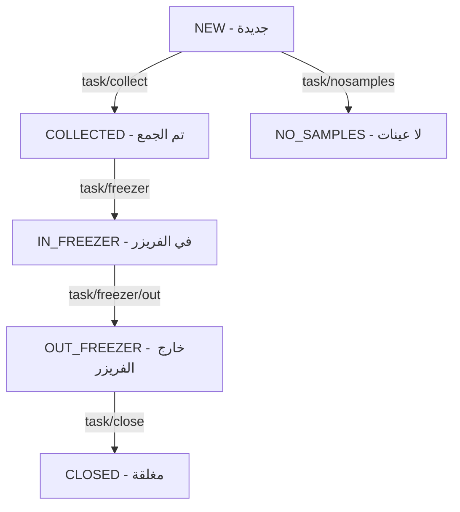

# تفاصيل شاشات Flutter - الجزء الثاني (Part 2: Freezer + Delivery + Swap + Money + Services)
# الفريزر + التوصيل + التبادل + التحويلات + الخدمات

---

## 10. Freezer Placement Screens — شاشات وضع العينات في الفريزر

### 10.1 FreezerOutBagsScreen — مسح الأكياس ← `FreezerOutBagsScanFragment`

**التصميم**: ماسح باركود + قائمة الأكياس الممسوحة + زر Continue
**الوصول**: من TaskList عند اختيار مهمة COLLECTED

```
اللوجيك:
├── عند فتح الشاشة:
│   └── POST task/bags/get مع {task_id} لجلب الأكياس
├── عند مسح باركود كيس:
│   ├── تحقق أنه موجود في قائمة الأكياس
│   ├── أضفه لقائمة الممسوح (scannedBagBarCodes Set)
│   └── حدّث العرض
├── عند الضغط على Continue:
│   ├── إذا تم مسح جميع الأكياس:
│   │   └── انتقل لـ FreezerScanContainerBarcodeFragment
│   └── إذا لم تُمسح كلها: Toast تحذير
```

### 10.2 FreezerContainerScanScreen — مسح باركود الحاوية ← `FreezerScanContainerBarcodeFragment`

**التصميم**: ماسح باركود كبير + حقل نصي يدوي + زر Submit

```
اللوجيك:
├── امسح أو أدخل باركود الحاوية يدوياً
├── عند النجاح:
│   ├── احفظ scannedContainerId + scannedContainerType في UserInfo
│   └── انتقل لـ TaskDetailFragment
```

### 10.3 FreezerBagScanScreen — مسح باركود الكيس ← `FreezerScanBagBarcodeFragment`

**التصميم**: ماسح باركود + حقل يدوي

```
اللوجيك:
├── امسح باركود الكيس
├── احفظ scannedBagBarCode في UserInfo
└── انتقل لـ TaskDetailFragment
```

### 10.4 TaskDetailScreen — تفاصيل مهمة الفريزر ← `TaskDetailFragment`

**التصميم**: يتغير حسب النوع (COLLECTED أو IN_FREEZER)
- Dropdown حاوية (Spinner)
- قائمة عينات الكيس
- أزرار: Add Bag / Scan Freezer / Save Bag / Close Freezers

```
اللوجيك (حالة COLLECTED):
├── عند الفتح:
│   ├── POST task/containers/bag للحصول على الحاويات
│   ├── تحقق أن الحاوية الممسوحة هي الصحيحة (isCorrectContainer)
│   ├── إذا صحيحة: POST samples/bag/type لجلب العينات
│   └── إذا خاطئة: Toast "Scan correct container"
├── أزرار ديناميكية:
│   ├── إذا لا يوجد scannedContainerType → أخفِ Submit و Close
│   ├── إذا لا يوجد scannedBagBarCode → أخفِ قائمة الباركودات
│   └── إذا يوجد كلاهما → اعرض الكل
├── زر Save Bag:
│   ├── تحقق: containerId != 0
│   ├── حوار تأكيد
│   └── POST samples/container/add مع {task_id, container_id, bag_code}
├── زر Close Freezers:
│   ├── حوار تأكيد
│   ├── POST task/freezer مع {task_id}
│   └── انتقل لـ TaskStatusFragment

اللوجيك (حالة IN_FREEZER):
├── زر Remove Samples:
│   ├── POST bag/container/remove مع {task_id, bag_code, container_id}
├── زر Close Freezers:
│   ├── POST task/freezer/out مع {task_id}
│   └── انتقل لـ TaskStatusFragment
```

**API المستخدمة:**
| Endpoint | الغرض |
|----------|-------|
| `task/containers/bag` | جلب حاويات المهمة |
| `samples/bag/type` | جلب عينات الكيس حسب النوع |
| `samples/container/add` | إضافة عينات للحاوية |
| `task/freezer` | إغلاق الفريزر |
| `bag/container/remove` | إزالة كيس من حاوية |
| `task/freezer/out` | إخراج من الفريزر |
| `task/bags/get` | جلب أكياس المهمة |

---

## 11. Delivery Screens (Out-Freezer) — شاشات التوصيل

### 11.1 DeliveryTaskListScreen — قائمة مهام التوصيل ← `OutFreezerTaskListFragment`
**مثل TaskListScreen** ولكن يستدعي `driver/client/tasks` بدل `driver/tasks`

### 11.2 DeliveryLocationCheckScreen — فحص الموقع ← `OutFreezerLocationCheckFragment`
**التصميم**: خريطة + معلومات الموقع + زر "Check Location"

```
اللوجيك:
├── POST tasks/location/check مع {task_ids[], lat, lng, driver_id}
├── إذا الموقع صحيح → انتقل لمسح الباركود
└── إذا الموقع خاطئ → Toast تحذير
```

### 11.3 DeliveryTokenScanScreen — مسح رمز المهمة ← `OutFreezerScanTaskTokenFragment`
**التصميم**: ماسح باركود لرمز المهمة

```
اللوجيك:
├── امسح رمز المهمة (Task Token)
├── تحقق من تطابقه مع بيانات المهمة
└── انتقل لـ DeliveryBagsScreen
```

### 11.4 DeliveryBagsScreen — الأكياس الممسوحة ← `OutFreezerScannedBagsFragment`
**التصميم**: قائمة الأكياس الممسوحة + أزرار

### 11.5 DeliverySignatureScreen — توقيع التسليم ← `OutFreezerSignatureFragment`
**التصميم**: قائمة العينات + حقل OTP + زر Submit

```
اللوجيك:
├── POST samples/list لعرض العينات
├── عند Submit:
│   ├── إذا مهمة واحدة: POST task/close مع {task_id, deliver_confirmationCode}
│   ├── إذا مهام متعددة: POST tasks/close مع {tasks[], deliver_confirmationCode}
│   └── عند النجاح → TaskStatusScreen
```

---

## 12. Swap Screens — شاشات التبادل

### 12.1 SwapTaskListScreen — قائمة طلبات التبادل ← `SwapTaskListFragment`
**التصميم**: قائمة طلبات التبادل + زر "Accept All"

```
اللوجيك:
├── POST swap/list/driver مع {driver_id}
├── كل طلب يعرض: تفاصيل المهمة + اسم السائق الطالب
├── أزرار لكل طلب:
│   ├── Accept: POST swap/accept مع {swap_id, driver_id}
│   ├── Reject: POST swap/reject مع {swap_id, driver_id}
│   └── Receive: تبدأ عملية الاستلام
├── زر Accept All:
│   └── POST swap/list/driver/accept-all مع {driver_id}
```

### 12.2 SwapBarcodeScanScreen — مسح باركود التبادل ← `SwapTaskBarcodeScanFragment`
**التصميم**: ماسح باركود + قائمة العينات

```
اللوجيك:
├── امسح باركودات العينات المتبادلة
├── POST swap/receive مع {swap_id, lat, lng}
└── عند النجاح → SwapCompleteScreen
```

### 12.3 SwapCompleteScreen — إتمام التبادل ← `SwapTaskFinishFragment`
**التصميم**: رسالة نجاح + زر العودة للرئيسية

---

## 13. Money Transfer Screens — شاشات التحويلات المالية

### 13.1 MoneyTransferListScreen — قائمة التحويلات ← `MoneyTransferTaskListFragment`
**التصميم**: قائمة التحويلات المالية

```
اللوجيك:
├── POST money/transfer/list مع {driver_id}
├── كل عنصر: المبلغ + من/إلى + الحالة
└── عند الضغط على عنصر → FromLocationOtpScreen
```

### 13.2 FromLocationOtpScreen — OTP موقع الاستلام ← `FromLocationVerifyOtpFragment`
**التصميم**: حقل إدخال OTP + زر Verify

```
اللوجيك:
├── أدخل OTP الاستلام
├── POST money/transfer/otp/from/verifiy مع {transfer_id, otp}
├── عند النجاح → ToLocationOtpScreen
└── عند الفشل → Toast "OTP خاطئ"
```

### 13.3 ToLocationOtpScreen — OTP موقع التسليم ← `ToLocationVerifyOtpFragment`
**مثل FromLocationOtpScreen** ولكن:
```
├── POST money/transfer/otp/to/verifiy
└── عند النجاح → MoneyTransferCompleteScreen
```

---

## 14. Supporting Screens — شاشات مساعدة

### 14.1 ProfileScreen — الملف الشخصي ← `ProfileActivity`
**التصميم**: اسم السائق + رقم الجوال + البريد + المدينة + معلومات السيارة
```
اللوجيك:
├── POST driver/profile مع {driver_id}
└── اعرض البيانات (read-only)
```

### 14.2 NotificationsScreen — الإشعارات ← `NotificationActivity`
**التصميم**: RecyclerView + عنصر لكل إشعار (عنوان + نص + تاريخ)
```
اللوجيك:
├── POST driver/notifications مع {driver_id}
├── عند الضغط على إشعار بنوع "open_task":
│   └── انتقل للمهمة المحددة (task_id + task_type)
```

### 14.3 ScheduleScreen — الجدول الزمني ← `ScheduleActivity`
**التصميم**: قائمة الجداول + زر "Accept All"
```
اللوجيك:
├── POST driver-schedule مع {driver_id}
├── زر Accept All:
│   └── POST driver/schedule/acceptall مع {driver_id, car_id}
```

### 14.4 TaskStatusScreen — حالة المهمة ← `TaskStatusFragment`
**التصميم**: أيقونة نجاح ✅ + رسالة "تمت العملية بنجاح" + زر العودة

---

## 15. Background Services — الخدمات الخلفية

### 15.1 Location Tracking Service — خدمة تتبع الموقع
```
الإعدادات:
├── interval: 30 ثانية
├── fastestInterval: 30 ثانية
├── maxWaitTime: 2 دقيقة
├── priority: HIGH_ACCURACY
├── يعمل كـ Foreground Service مع Notification دائمة

اللوجيك:
├── عند كل تحديث موقع:
│   ├── POST driver/location مع {driver_id, lat, lng}
│   └── أرسل الموقع عبر EventBus/Stream للشاشات
├── تُبدأ الخدمة عند دخول الرئيسية
└── تُوقف عند الخروج

في Flutter:
├── استخدم flutter_background_service أو workmanager
├── استخدم geolocator للموقع
└── استخدم StreamController لإرسال الموقع للشاشات
```

### 15.2 FCM Notifications Service — خدمة الإشعارات
```
عند استلام إشعار:
├── اعرض Notification محلية
├── إذا الإشعار يحتوي action == "open_task":
│   ├── تحقق: المستخدم مسجل دخول + قبل الشروط
│   ├── استخرج task_id + task_type + task_object
│   └── افتح MainActivity مع بيانات المهمة (Deep Link)
```

---

## 16. Task Status Flow — ملخص جميع حالات المهمة وتدفقاتها



## 17. UserInfo State — بيانات مهمة يجب حفظها أثناء التنقل

```dart
// يجب أن يكون Provider/Cubit عام في التطبيق
class UserInfoState {
  LoginData? loginInfo;           // بيانات المستخدم
  String selectedTaskType;        // NEW, COLLECTED, IN_FREEZER, OUT_FREEZER
  DriverTask? selectedTask;       // المهمة المختارة
  int boxCount;                   // عدد الصناديق
  int sampleCount;                // عدد العينات
  String signatureFileName;       // اسم ملف التوقيع
  OutFreezerTask? selectedOutFreezerTask;
  int selectedContainerType;      // 0=ROOM, 1=REF, 2=FROZEN
  String? scannedBagBarCode;      // باركود الكيس الممسوح
  Set<String> scannedBagBarCodes; // مجموعة أكياس ممسوحة
  int scannedContainerId;         // ID الحاوية الممسوحة
  String scannedContainerType;    // نوع الحاوية
  String selectedSampleType;      // نوع العينة
  String? scannedLocationID;      // ID الموقع الممسوح
  String scannedLocationName;     // اسم الموقع
  int fromLocationID;
  int toLocationID;
  List<SampleBarCode> scannedBarCodes;  // الباركودات الممسوحة
  Location? driverLocation;       // موقع السائق
  MultiSwapTask? selectedSwapTask;
  MoneyTransferTask? selectedMoneyTask;
}
```

---

## 18. Developer Notes — ملاحظات نهائية للمطور

> [!IMPORTANT]
> 1. **اللغة**: التطبيق يدعم العربية والإنجليزية. استخدم `flutter_localizations` + ملفات ARB
> 2. **الاتجاه**: في العربية، اعكس أيقونات الأسهم (rotation 180°)
> 3. **الخط**: استخدم Nunito (Bold + Regular) من Google Fonts
> 4. **اللون الأساسي**: `colorMainTextBlue` - أزرق غامق
> 5. **جميع الأزرار**: زوايا مستديرة + ارتفاع 48dp
> 6. **الـ Loading**: كل API يعرض loading overlay ويخفيه عند الانتهاء
> 7. **الأخطاء**: جميعها تُعرض كـ Toast/SnackBar
> 8. **حفظ التوقيع**: حالياً معطّل - يتم الإرسال بدون توقيع
> 9. **Barcode count**: كل باركود له خاصية `count` - يُكرر في المصفوفة المرسلة
> 10. **EventBus**: في Flutter يُستبدل بـ Bloc events أو StreamController
